


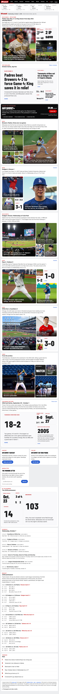



# Layout study — the ESPN front page, as GIFcommit

**Live:** [`https://gregoryedgerton.github.io/golden-grids-study-06-espn/`](https://gregoryedgerton.github.io/golden-grids-study-06-espn/)

An unaffiliated layout study. It rebuilds the structure of the espn.com
front page — a scoreboard strip, a lead story card, a headline list, story
cards with strips of people under them, video, promotions, the schedule, the
bracket and a trending list — as stacked golden grids, for a fictional
network called GIFcommit, on the morning of Wednesday, October 7, 2026, the fifth
day of the 2026 MLB Division Series. The games, scores, records and the
people who decided them are the public record; the copy is the study's own;
the network, its products and its prices are invented, and the forms send
nothing. Nothing from ESPN — photography, wordmarks, copy — is reproduced.
Built with [Golden Grids](https://github.com/gregoryedgerton/golden-grids)
from the [study template](https://github.com/gregoryedgerton/golden-grids-study-template).

## Reference

[espn.com](https://www.espn.com/), captured 2026-10-06 at 390 / 820 / 1440
([`captures/reference-*.png`](captures/)); the 1440 capture is washed out by
an overlay the page draws while loading. The page is a black global bar, a
scoreboard strip, then three columns at 1440: a left rail of links, a centre
feed of story and game cards (a hero image, a headline, four related items),
and a right rail of Top Headlines, a promotion, video and Trending Now. At
390 the rails fold into the feed. Measured tokens are in
[`captures/tokens.json`](captures/tokens.json): white cards with a 10px
radius on a cool grey ground, body type in the system face at `#48494a`,
blue links, a red live dot, condensed display type for scores.

| Width | Reference | Rebuild |
| --- | --- | --- |
| 390px |  |  |
| 820px |  |  |
| 1440px |  |  |

## The claim

A sports front page is a ranking — one lead, a few second stories, a strip
of smaller items — and a golden grid is a ranking with sizes attached, so
each story card becomes one grid: the person who decided the game in the
largest square, the score in the smallest, with the type set to fit.

## The page

One page. Bands in order; measured sizes are the grid's width×height at
390 / 820 / 1440. Flat modules between them (the GIFcommit+ banner, the
promotions, the schedule, the bracket, trending) are lists and cards, not
grids. Breakpoints live in [`src/lib/viewport.ts`](src/lib/viewport.ts).

| Band | Range · placement · clockwise | Measured | What it holds |
| --- | --- | --- | --- |
| Lead | 1–6 · left · cw (top at 390) | 332×540 / 762×469 / 1246×767 | Padres 4, Brewers 3: Machado, Petco Park, King's save, the roof ball, 1969, Miller's forty pitches |
| Top headlines | 1–6 · left · ccw (two 1–3 grids, top / bottom, at 390) | 2×(332×221) / 762×469 / 1246×767 | Six headlines fitted to their squares, the two smallest in short form; More opens each story |
| Brewers–Padres, people | 1–6 · right · cw (top at 390) | 332×540 / 762×469 / 1246×767 | Contreras, Chourio, Tatis, Miller, Yelich, Megill |
| Dodgers 2, Braves 1 | 1–6 · right · cw (bottom at 390) | 332×540 / 762×469 / 1246×767 | Yamamoto, Harris, Muncy; the three scores |
| Dodgers–Braves, Game 4 | 1–6 · left · ccw (bottom at 390) | 332×540 / 762×469 / 1246×767 | Truist Park, Acuña, Olson, Freeman, Hernández, Albies |
| Rays 2, Yankees 0 | 1–5 · top · cw (right at 390) | 332×531 / 762×476 / 1246×779 | Rasmussen, Aranda, 1–0, Rice, 5–2 |
| White Sox 2, Guardians 0 | 1–5 · bottom · ccw (left at 390) | 332×531 / 762×476 / 1246×779 | Progressive Field, Kwan, 3–0, Ramírez, 4–3 |
| Video | 1–4 · right · cw (bottom at 390) | 332×553 / 762×457 / 1246×748 | Three Commons clips with the whole file on request; GIFcommit+ |
| Wild Card round | 1–6 · left · cw (two 1–3 grids at 390) | 2×(332×221) / 762×469 / 1246×767 | 18–2, 2005, Sept. 27, 8–0, 2–1, .500 |
| By the numbers | 1–6 · right · ccw (two 1–3 grids at 390) | 2×(332×221) / 762×469 / 1246×767 | 103, 14, Oct. 23, 3 of 4, 2, 5 |

All eight placement × direction orientations appear across the widths.

## The subject

The 2026 postseason as it stood on the morning of October 7: the Wild Card
round complete (three sweeps; Braves over Phillies in three), and the four
Division Series at 2–0, 2–0, 2–1 and 2–1 after the Padres' 4–3 win in Game 3
on the night of the 6th. Scores, dates, venues, pitching lines and the
facts in the squares were checked against MLB's and ESPN's published box
scores and the Wikipedia articles on the [2026 postseason](https://en.wikipedia.org/wiki/2026_Major_League_Baseball_postseason),
[ALDS](https://en.wikipedia.org/wiki/2026_American_League_Division_Series),
[NLDS](https://en.wikipedia.org/wiki/2026_National_League_Division_Series)
and the two Wild Card Series. Nothing after that morning is on the page.

Photographs and video are Wikimedia Commons files under CC0, CC BY or
CC BY-SA; the attribution each licence requires is in the page footer and
in [`captures/commons.tsv`](captures/commons.tsv) (file, author, licence,
date, URL). Players are shown in the uniform the photograph caught them in,
which for Freeman (Dodgers, 2024), Harris and Olson (Braves, 2022) is their
current club; no photograph is a frame of broadcast. Three clips were cut
from two Commons videos (`public/clips`, ten seconds, square, silent). No
free-licence video of a 2026 postseason game exists, so the video module is
labelled an archive and says what each clip is.

## How it works

- Every copy slot is a `Fact` from [`src/lib/boxes.tsx`](src/lib/boxes.tsx)
  with its line fitted by [`src/lib/fit.tsx`](src/lib/fit.tsx), capped at
  120px; body copy comes in two lengths and the square's height picks one.
  Container queries remove body copy under 200px of height and the label
  under 64px; the two smallest headline squares carry a short form with the
  headline as its spoken text.
- Every photograph expands in place ([`src/lib/expand.tsx`](src/lib/expand.tsx))
  to its full frame, its description and its credit; every fact with a
  longer passage has a More control. The band grows; nothing scrolls inside
  a box; covered content is inert.
- The scoreboard strip, the GIFcommit+ banner, the promotions, the newsletter
  form, the schedule, the bracket and Trending are flat, as the reference's
  are. The form sends nothing and says so.
- Clips play silently while on screen and are their posters under reduced
  motion; "Play the whole clip" loads Commons' H.264 derivative in the square.
- Light is the reference's; dark is its app scheme, the same greys turned
  over, by device preference. Barlow Condensed stands in for the reference's
  proprietary condensed face; body type is the system stack, as measured.
- [`captures/scan.cjs`](captures/scan.cjs), Chrome and WebKit, 390 / 820 /
  1440, light and dark: nothing overflows, no fitted line under 12px, axe
  (WCAG 2.0/2.1/2.2 A/AA, best practice) clean with a More open. The
  smallest fitted line is the 36px square at 820 ("14"). No screen-reader
  user has tested it.

## What did not

- The 1440 reference capture is partly obscured by a loading overlay; the
  inventory was taken from the DOM (`captures/reference-1440.json`) and the
  390 and 820 captures.
- A 120px cap on the fitted line leaves the hero square of a six-grid
  mostly ground at 1440 (the "103" and "14" squares); the long body copy
  fills some of it, not all.
- The free-licence photographs are what Commons has, not what a desk would
  pick: no White Sox player is pictured, and the two Guardians are shown in
  2022–23 uniforms.
- ESPN's left rail (Watch, Quick Links, Fantasy, Sites, Apps) is not
  rebuilt; its matter is in the global bar, the GIFcommit+ banner and the
  promotions.

## Study tools

A floating panel (top right) toggles grid outlines (`g`), band notes (`n`,
which carry each band's range and placement) and reduced motion (`m`).

## Running and deploying

```bash
npm install
npm run dev
```

`npm run build` type-checks and builds to `dist/`; pushing to `main` deploys
to GitHub Pages. The library is consumed from npm at its published version,
never linked locally.
